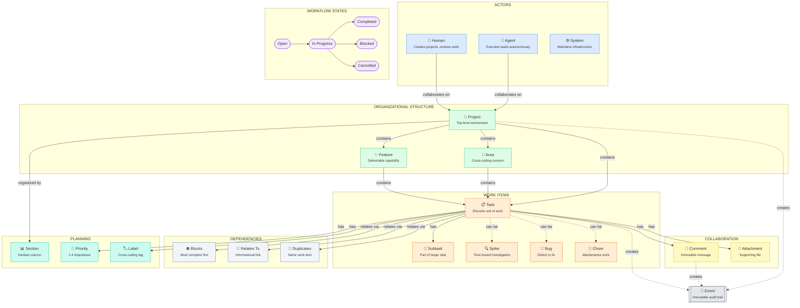

# wrkq Conceptual Domain Model

This document describes the conceptual domain model for wrkq - the business concepts, their meanings, and how they relate to each other in the problem domain. This is not a database schema; it's a model of the concepts users work with.

> **Implementation Status**: Most concepts are fully implemented in both schema and CLI. Exceptions are noted where applicable (e.g., Sections have schema support but no CLI commands yet).

---

## The Domain: Human-Agent Task Collaboration

wrkq is a collaboration surface where **humans** and **coding agents** work together on software projects. The core problem it solves: tracking work across multiple autonomous actors while maintaining clear attribution and preventing conflicts.

---

## Actors (Who Does the Work)

Work in wrkq is performed by actors. Each actor has a distinct identity and role.

### Human

A person interacting with the system. Humans typically:
- Create and organize projects
- Define tasks and acceptance criteria
- Review agent work
- Make strategic decisions

### Agent

An AI coding assistant (Claude, GPT, etc.) performing automated work. Agents:
- Execute tasks autonomously
- Report progress via comments
- Create subtasks as they discover work
- Operate within defined boundaries

### System

Internal processes that maintain the system:
- Database migrations
- Initialization routines
- Repair operations

---

## Organizational Structure

Work is organized hierarchically, mirroring how teams think about software projects.

### Project

A top-level organizational boundary. Projects are independent workstreams that don't share tasks. Examples:
- "customer-portal" - A web application
- "api-service" - A backend service
- "documentation" - Docs site

### Feature

A deliverable capability within a project. Features represent user-visible functionality that can be planned, worked on, and completed. Examples:
- "user-authentication" - Login/logout flow
- "payment-processing" - Checkout integration
- "search" - Full-text search capability

### Area

A cross-cutting concern that spans features. Areas group related work that doesn't fit neatly into a single feature. Examples:
- "performance" - Speed optimizations anywhere
- "security" - Security hardening across the system
- "tech-debt" - Refactoring and cleanup

### Miscellaneous Container

A catch-all for items that don't fit elsewhere. Used for:
- Temporary holding areas
- Exploratory work
- Uncategorized items

---

## Work Items

The actual units of work that get done.

### Task

A discrete piece of work that can be assigned, tracked, and completed. Tasks have:
- A clear definition of done
- An owner (assignee)
- A current state
- Priority relative to other tasks

### Subtask

A smaller piece of work that's part of a larger task. Subtasks:
- Cannot exist independently (always belong to a parent task)
- Cannot have their own subtasks (single level only)
- Share the context of their parent

### Spike

A time-boxed investigation to reduce uncertainty. Spikes:
- Answer a specific question
- Have a fixed duration
- Result in knowledge, not code
- Example: "Investigate auth library options"

### Bug

A defect that needs fixing. Bugs:
- Describe unexpected behavior
- Reference expected vs actual behavior
- May include reproduction steps

### Chore

Maintenance work that doesn't add features. Chores:
- Improve code quality
- Update dependencies
- Refactor without changing behavior
- Example: "Upgrade to React 19"

---

## Workflow States

Tasks move through states as work progresses.

### Idea

Pre-triage concept captured for later refinement. Ideas are intentionally excluded from default views until promoted to draft.

### Draft

Triage-ready work that is defined enough to evaluate but not yet committed to execution.

### Open

Work has been defined but not started. The task is in the backlog, waiting to be picked up.

### In Progress

Someone is actively working on this task. Only one actor should have a task in progress at a time.

### Blocked

Work cannot continue due to an external dependency. The blocking issue should be documented.

### Completed

The work is done and meets acceptance criteria. The task is closed but remains visible for history.

### Cancelled

The work will not be done. The reason should be documented. Different from "completed" - nothing was delivered.

### Archived (Visibility)

Not a workflow state, but a visibility filter. Archived items have an `archived_at` timestamp set and are hidden from default queries. Archiving preserves history while decluttering the active view.

---

## Collaboration

How actors communicate and coordinate.

### Comment

An immutable message attached to a task. Comments serve as the async communication channel between humans and agents. Once posted, comments cannot be edited (ensuring audit integrity).

Comments typically contain:
- Progress updates ("Implemented the login form")
- Questions ("Should this support SSO?")
- Blockers ("Waiting on API credentials")
- Completion notes ("Done. Added tests for edge cases.")

### Attachment

A file associated with a task. Attachments provide supporting materials:
- Screenshots of bugs
- Design mockups
- Log files
- Specification documents

---

## Planning Concepts

Tools for organizing and prioritizing work.

### Section (Kanban Column)

> **Note**: Sections are defined in the schema and domain types, but CLI commands for section management are not yet implemented.

A workflow stage for visualizing work. Sections represent where work sits in the process:

- **Backlog** - Not yet prioritized
- **Ready** - Prioritized and ready to start
- **Active** - Currently being worked on
- **Review** - Awaiting review or approval
- **Done** - Completed

Sections can have WIP (Work In Progress) limits to prevent overload.

### Priority

Relative importance of a task (1-4, where 1 is highest). Priority helps actors decide what to work on next when multiple tasks are available.

### Label

A tag for categorizing tasks orthogonally to the hierarchy. Labels enable filtering across projects:
- "backend" / "frontend"
- "urgent"
- "needs-design"

---

## Task Dependencies

How tasks relate to each other beyond the hierarchy.

### Blocks

Task A blocks Task B means B cannot start until A is complete. This models sequential dependencies:
- "Design API schema" blocks "Implement API endpoints"
- "Set up CI" blocks "Add automated tests"

### Relates To

An informational link between related tasks. No dependency implied, just awareness:
- "Update docs" relates to "Add new feature"
- "Fix bug X" relates to "Fix bug Y" (similar root cause)

### Duplicates

Indicates one task is a duplicate of another. The duplicate should typically be closed in favor of the original.

---

## Attribution & Audit

Every change in wrkq is attributed and recorded.

### Attribution

All modifications record who made them. This enables:
- Understanding who changed what
- Filtering to see one actor's work
- Accountability without authentication

### Event

A record of something that happened. Events are append-only - they can never be modified or deleted. The event stream provides:
- Complete history of all changes
- Ability to understand how state evolved
- Audit trail for compliance

---

## Concurrency Model

How multiple actors work without conflicts.

### Optimistic Concurrency

When updating, actors specify what version they're changing. If someone else changed it first, the update fails rather than silently overwriting. The actor must then:
1. Re-read the current state
2. Merge their changes with the new state
3. Retry the update

This enables multiple humans and agents to work on the same database safely.

---

## Addressing

How to refer to things in wrkq.

### Path

A filesystem-like address: `project/feature/task-slug`

Paths are human-readable and reflect the organizational hierarchy.

### Friendly ID

A short, memorable identifier: `T-00123`, `P-00007`

Friendly IDs are stable - they never change even if a task moves.

### Slug

The URL-safe name segment: `user-authentication`, `fix-login-bug`

Slugs are lowercase, use hyphens, and are unique among siblings.

---

## Diagram (Mermaid)



---

## Summary: Concept Relationships

```
HUMANS and AGENTS (actors) collaborate on PROJECTS

PROJECTS contain:
  - FEATURES (deliverable capabilities)
  - AREAS (cross-cutting concerns)
  - TASKS (work items)

FEATURES and AREAS contain TASKS

TASKS can be:
  - Regular tasks
  - Subtasks (children of tasks, one level deep)
  - Spikes (investigations)
  - Bugs (defects)
  - Chores (maintenance)

TASKS have:
  - STATE (open → in_progress → completed/cancelled/blocked)
  - PRIORITY (1-4)
  - LABELS (tags)
  - COMMENTS (discussion thread)
  - ATTACHMENTS (files)

TASKS relate via:
  - BLOCKS (must complete first)
  - RELATES TO (informational)
  - DUPLICATES (same work)

SECTIONS organize tasks into kanban columns within projects (planned, not yet in CLI)

All changes create EVENTS (immutable audit trail)
```
